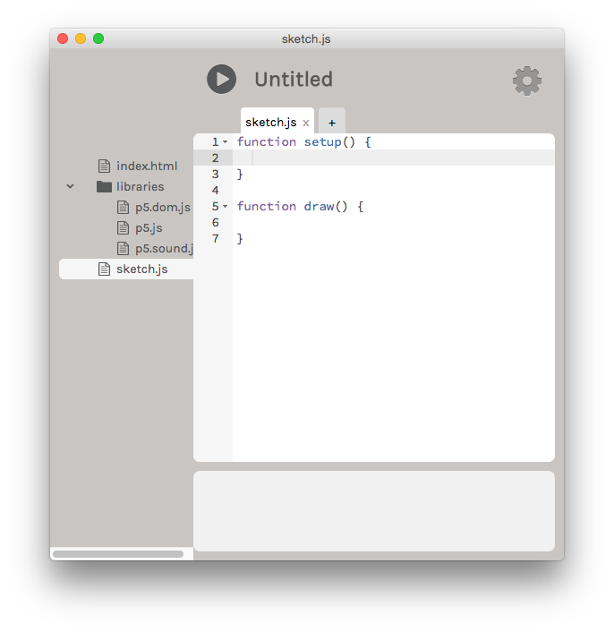

# Getting Started

## Setup

Visit [P5js.org](http://p5js.org/) and download the [P5.js Editor](http://p5js.org/download/) for your specific operating system. 

<!-- -->
<!---->

P5.js            |  P5.js Editor
:-------------------------:|:-------------------------:
  |  